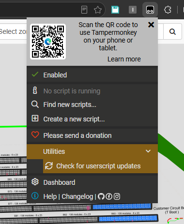

# ReadMe

Version: 2 (Caravanserai)

Requires: TamperMonkey Edge/Chrome Extension 

## Intro

JS injection for easier and more efficient list checking within Analyst Survey.

A userscript can only do so much, but the aim is to reduce unnecessary clicks, maximise usable screen space, and improve the overall review workflow.

(+tip: double tap Ctrl while hovering an image in Edge to use the browser's native image zoom. It is significantly smoother than the built-in Solargain image zoom.)

Feedback, bug reports, and feature suggestions are welcome: [Issues & Suggestions](https://outlook.office.com/mail/deeplink/compose?to=adam.kenning@abovesurveying.com&subject=AboveInject%20Feedback&body=Please%20describe%20the%20issue%20or%20suggestion%20below:)

## Setup

Disable or uninstall any previous JS injection extensions, as they may conflict with this version.

See [setup For Edge](misc/edge/setup.md)

See [setup For Chrome](misc/chrome/setup.md)

To update your local instance of the script for new features, click to check for updates here

## Sample Imgs

## Major Updates

### 3.0.0: --------- (03/09/26)
Refinement of the platform, adding installation guides, integrated update management, and separate JS/CSS versioning for more reliable maintenance and deployment. Navigation and workflow improvements include quick page controls, automatic tab restoration after reloads, a temporary disable option for troubleshooting, and More anomaly amounts per page optoins (E.g. 500, 1k) for larger reviews.

Data Mode enhanced with the horizontal return of anomaly editing controls and additional columns visibility improvements, while Image Mode gains variable cursor-based zooming and improved support for constrained layouts. Basic anomaly detection indicators have been introduced to flag common issues (E.g. HS/MHC/Missing Modules/Tracker Gradients), alongside image cache management and lazy reloading to reduce internal server load. General interface updates and visual refinements have also been applied throughout to improve overall usability and responsiveness.

### 2.0.0: Phenomenon (20/08/26)

Migration to centralised GitHub/Tampermonkey distribution, allowing simpler installation and future easy update roll outs. Includes requested features and general quality-of-life improvements. Several columns that had previously been removed have been restored based on analyst feedback. Data Mode once again displays the full dataset, with columns reorganised for improved usability.

Added a basic dark mode option using CSS colour inversion, with the chosen preference stored between sessions. Filter widths are now fixed to prevent column resizing during use. Row heights have been reduced to maximise the amount of visible data on screen, and sticky header behaviour has been updated to provide more consistent results across different monitor sizes and resolutions.

### 1.0.0: Abraxas (18/08/26) 

Introduced a bimodal Image/Data view system. Image Mode prioritises image size and visibility for reference checking and visual review tasks. Data Mode focuses on maximising tabular information for gradient checking and other data-driven workflows.

Also includes the removal of unused analyst columns, reduced page padding to maximise available workspace, sticky table headers, and expanded row count options of 100, 500, and 1000 records (defaulting to 100 on page load).
