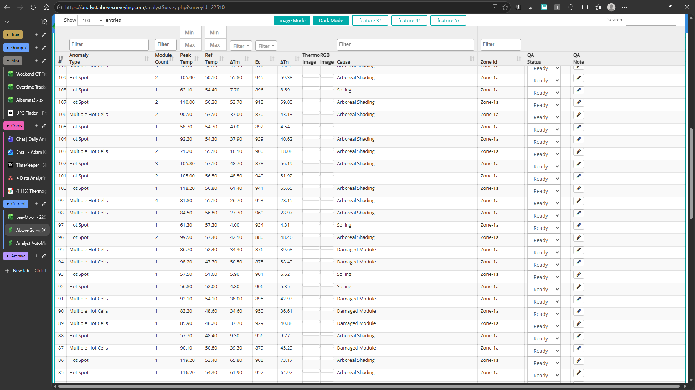
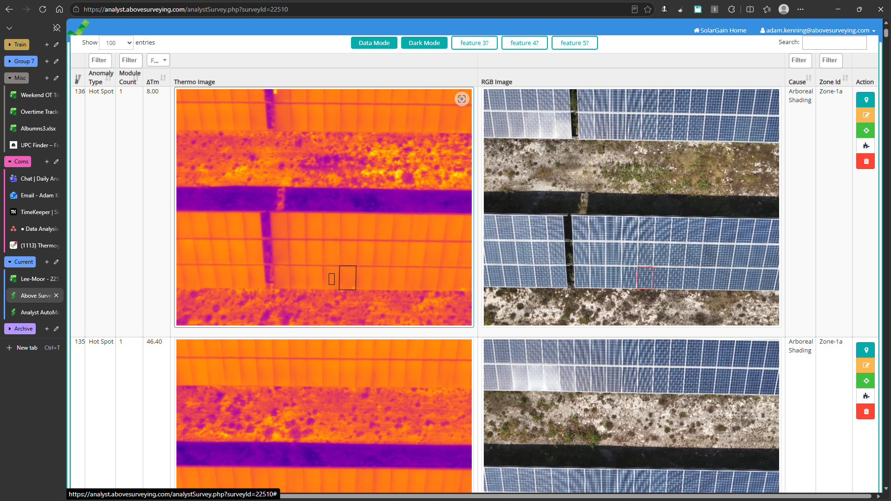

# ReadMe

Version: 2 (Caravanserai)

## Intro

JS injection for easier and more efficient list checking within Analyst Survey.

A userscript can only do so much, but the aim is to reduce unnecessary clicks, maximise usable screen space, and improve the overall review workflow.

(+tip: double tap Ctrl while hovering an image in Edge to use the browser's native image zoom. It is significantly smoother than the built-in Solargain image zoom.)

Feedback, bug reports, and feature suggestions are welcome: [Issues & Suggestions](https://outlook.office.com/mail/deeplink/compose?to=adam.kenning@abovesurveying.com&subject=AboveInject%20Feedback&body=Please%20describe%20the%20issue%20or%20suggestion%20below:)

## Setup

Disable or uninstall any previous JS injection extensions, as they may conflict with this version.

See [setup For Edge](misc/edge/setup.md)

See [setup For Chrome](misc/chrome/setup.md)

Updates will be checked for automatically once per day, but this can be done manually.

See [Manual Updating]()

## Sample Imgs

## Updates

### 20/08/26 - 2.0.0 (Caravanserai)

Migration to centralised GitHub/Tampermonkey distribution, allowing simpler installation and future automatic updates. Includes requested features and general quality-of-life improvements. Several columns that had previously been removed have been restored based on analyst feedback. Data Mode once again displays the full dataset, with columns reorganised for improved usability.

Added a basic dark mode option using CSS colour inversion, with the chosen preference stored between sessions. Filter widths are now fixed to prevent column resizing during use. Row heights have been reduced to maximise the amount of visible data on screen, and sticky header behaviour has been updated to provide more consistent results across different monitor sizes and resolutions.

### 18/08/26 - 1.0.0 (Abraxas)

Introduced a bimodal Image/Data view system. Image Mode prioritises image size and visibility for reference checking and visual review tasks. Data Mode focuses on maximising tabular information for gradient checking and other data-driven workflows.

Also includes the removal of unused analyst columns, reduced page padding to maximise available workspace, sticky table headers, and expanded row count options of 100, 500, and 1000 records (defaulting to 100 on page load).
