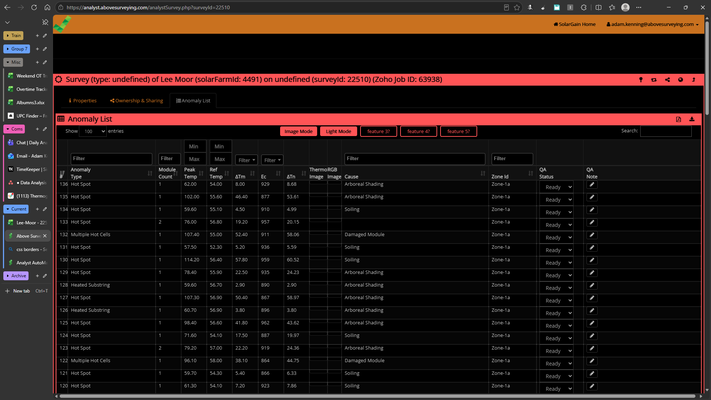
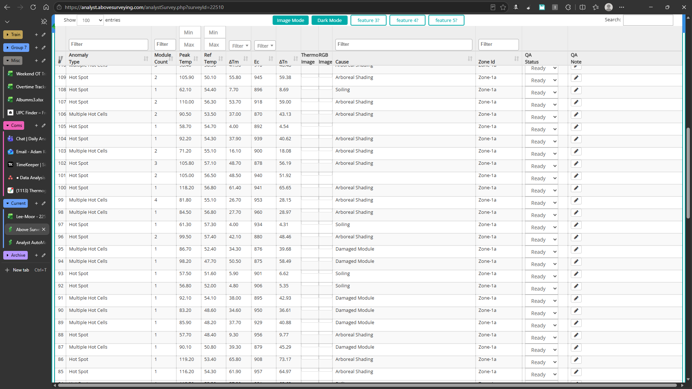
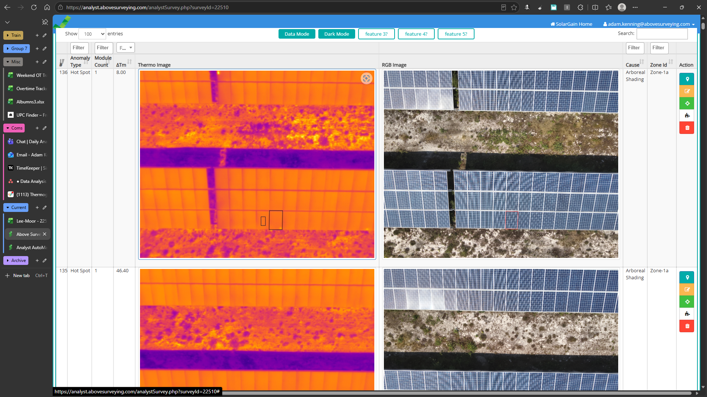

# ReadMe

## Intro

JS injection for way easier list checking for analysts. 

JS injection is itself still limited but the hope is it helps. 
(+tip: double tap ctrl for image zooming for edge - native image zooming so its way superior than the solargain image "zoom")

lmk what works/doesn't for possible later changes if i cba ?

## Setup

[Setup For Edge](misc/edge/setup.md)

[Setup For Chrome](misc/chrome/setup.md)

## Sample Imgs

## Update 2.0.0

new lore drop. with suggested features from Dilanka + general QOL improvements. some columns that i didn't use but others used are back. data mode has all columns again, just reshuffled. basic dark mode (double css colour invert) switching with permanent storage. fixed width filters so columns dont resize. row heights squashed to maximise screen usage. sticky header fix for different monitors should work fine now.

## Update 1.0.0

bimodal image/data. to see images as big as possible for ref checking etc, then separately to see pure data for e.g. gradient checking etc.
also hides columns we don't care about or interact with as analysts + other stuff like maximising the view size in the monitor - no padding outside the datafram and QOL stuff like sticky headers, changing max rows to 100,500,1k (default=100 on page load)
