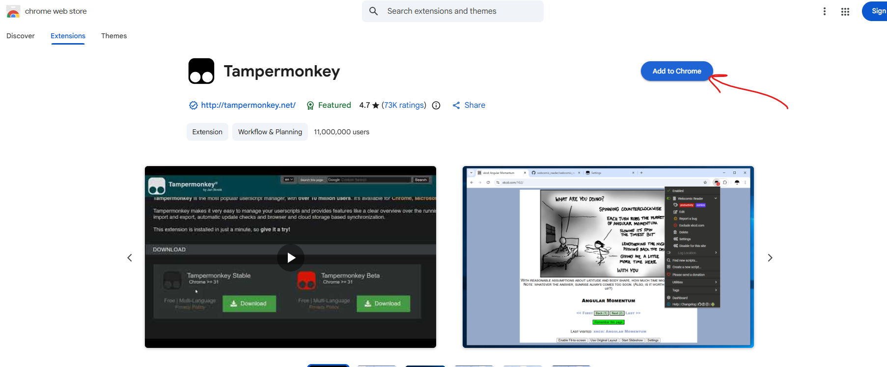
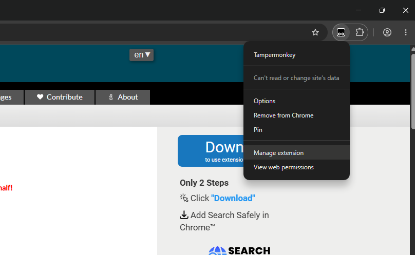
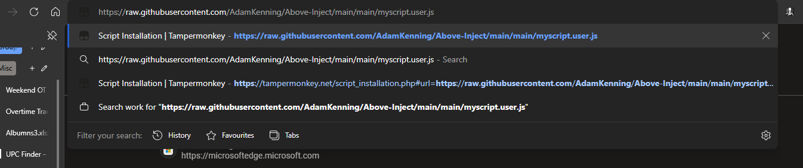
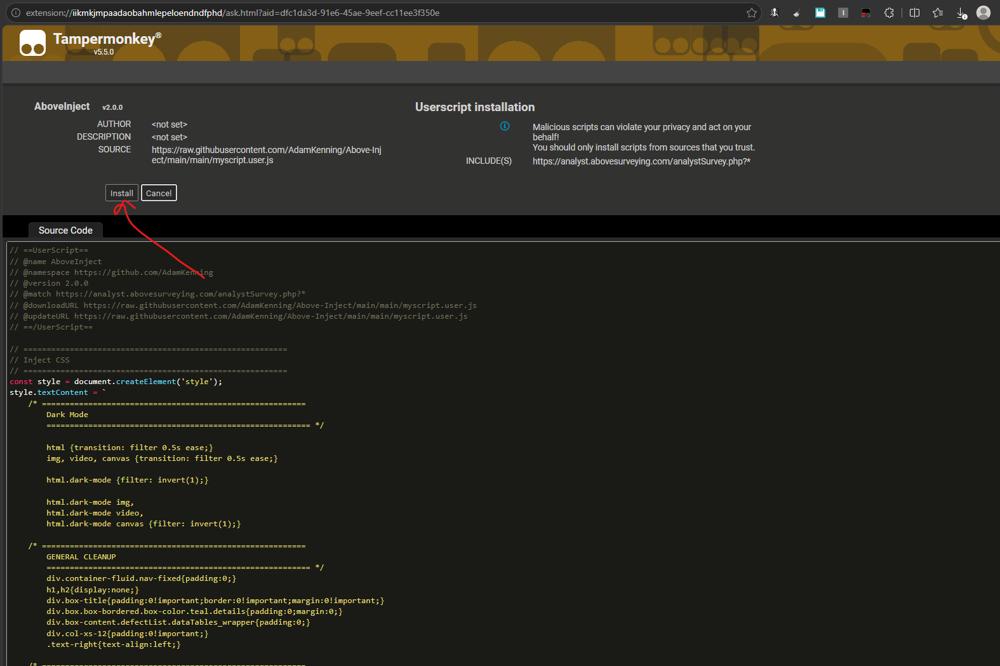
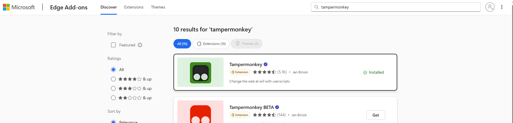
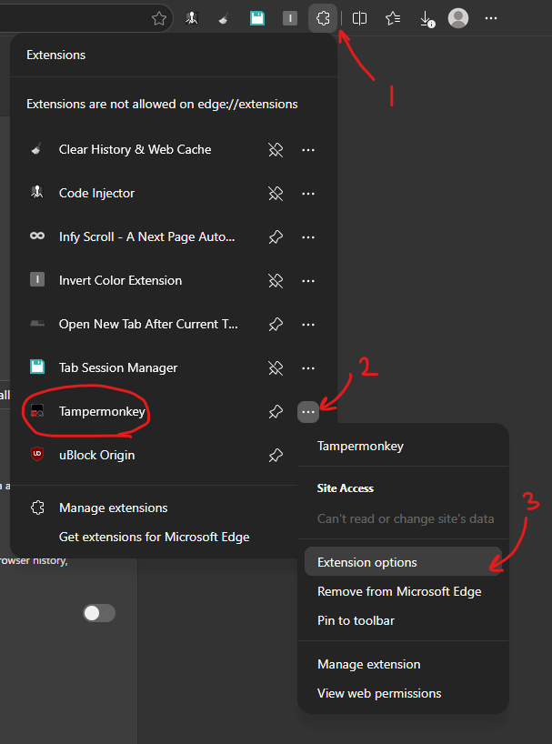
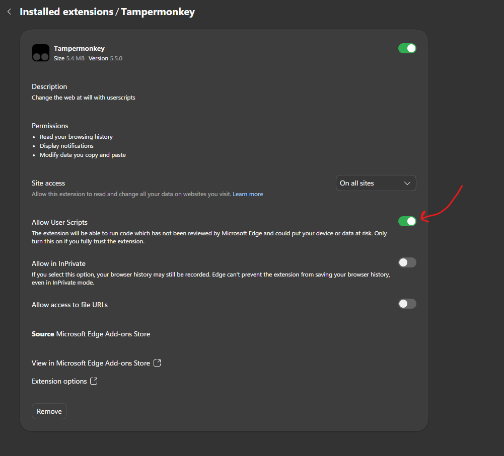

# Setup

Disable or uninstall any previous JS injection extensions, as they may conflict with this version.

- Jump to [Chrome Setup](#chrome)
- Jump to [Edge Setup](#edge)

## Chrome Setup

### 1. Setup TamperMonkey

Get TamperMonkey

Chrome web Store: <https://chromewebstore.google.com/>

TamperMonkey: <https://chromewebstore.google.com/detail/dhdgffkkebhmkfjojejmpbldmpobfkfo?utm_source=item-share-cb>

### 2. Allow UserScripts

Navigate to Extension settings and click allow user scripts

### 3. Install Above Inject

Link: <https://raw.githubusercontent.com/AdamKenning/Above-Inject/main/main/myscript.user.js>

Paste this link into your brouser search and TamperMonkey will automatically intercept it

Click install then reload solargain and it should work

## Edge Setup

### 1. Setup TamperMonkey

Get TamperMonkey

Edge Store: <https://microsoftedge.microsoft.com/addons/Microsoft-Edge-Extensions-Home>

TamperMonkey: <https://microsoftedge.microsoft.com/addons/detail/tampermonkey/iikmkjmpaadaobahmlepeloendndfphd>

### 2. Allow UserScripts

Navigate to Extension settings and click allow user scripts

### 3. Install Above Inject

Link: <https://raw.githubusercontent.com/AdamKenning/Above-Inject/main/main/myscript.user.js>

Paste this link into your brouser search and TamperMonkey will automatically intercept it

Click install then reload solargain and it should work

