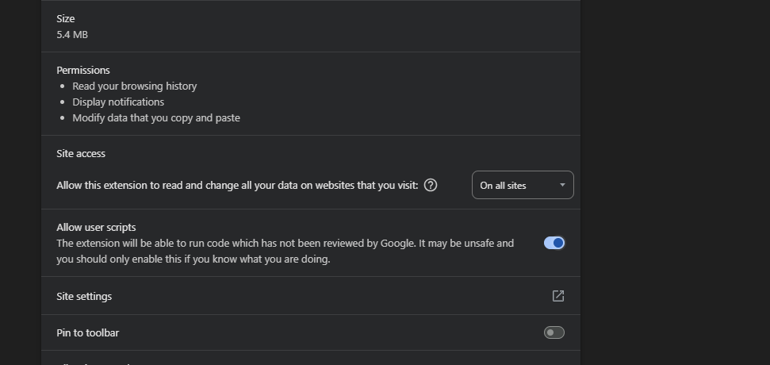
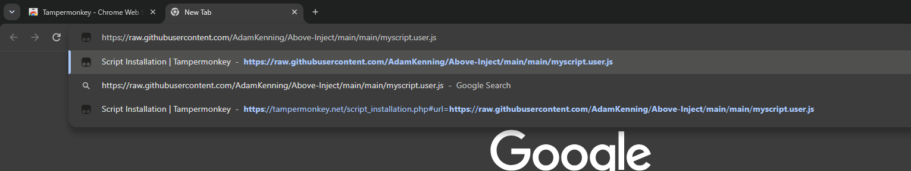
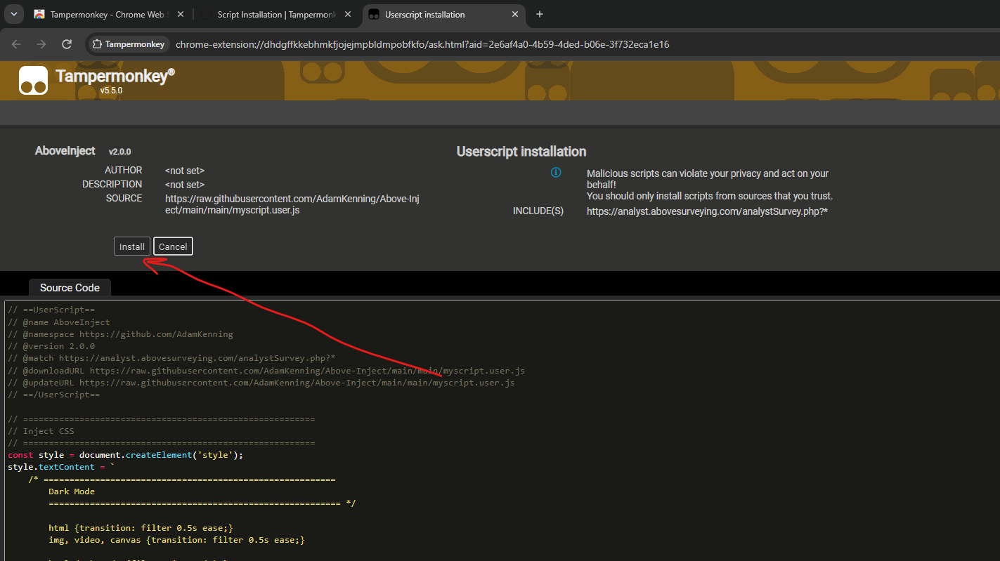

# Setup

Disable or uninstall any previous JS injection extensions, as they may conflict with this version.

## 1. Get TamperMonkey

Chrome web Store: <https://chromewebstore.google.com/>

TamperMonkey: <https://chromewebstore.google.com/detail/dhdgffkkebhmkfjojejmpbldmpobfkfo?utm_source=item-share-cb>

## 2. Allow User Script Access

Navigate to Extension settings and click allow user scripts

## 3. Get Above-Inject Script

Link: <https://raw.githubusercontent.com/AdamKenning/Above-Inject/main/main/myscript.user.js>

Paste this link into your brouser search and TamperMonkey will automatically intercept it

Click install then reload solargain and it should work

