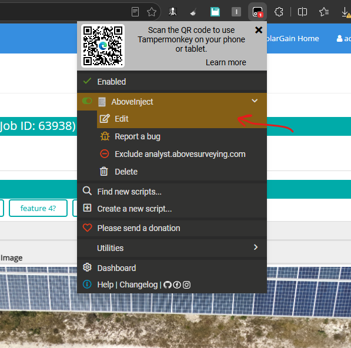
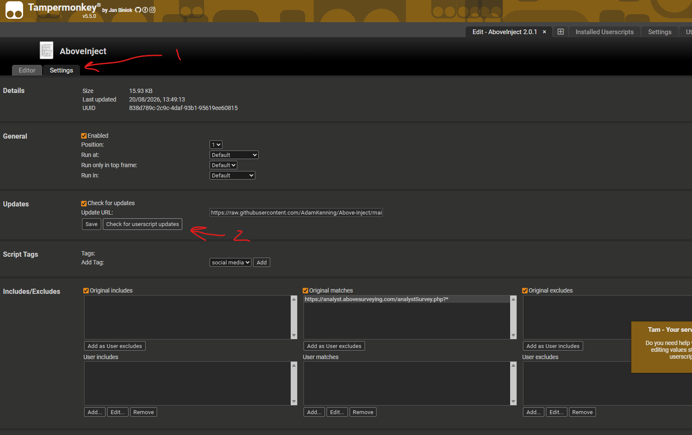
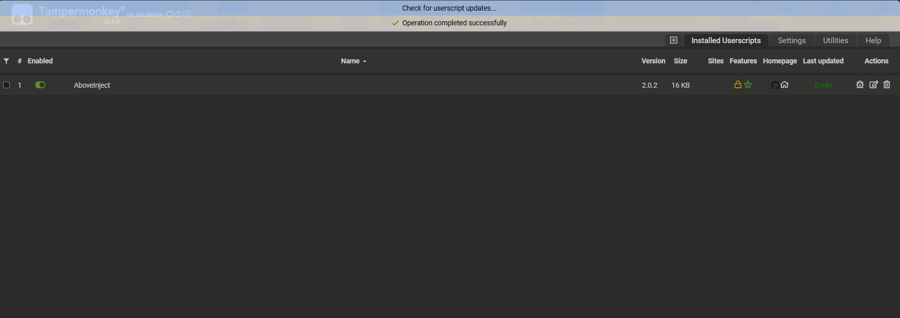

# Manually Triggering Updates

To manually trigger an update, incase of new updates.

## Open the script settings

Dropdown for AboveInject visable from survey page

 
## Check for updates

If updates are available, they will be updated.

A token at the top of the screen will appear saying "operation completed successfully"

